# Numerical analysis project p1.4
Final exam of Numerical Analysis for the Master in High Performance Computing

author: Myself

## Instructions

Do `make` to compile the shared libraries,
and `make check` to run tests.
The file `data/benchmarks.txt` summarizes the benchmarks performed right after the tests.
The latter can also be called with the execution of the script `test.py`.

In the file `classify.py` there is a class named `Oracle` that classifies 28x28 images.
For details see the code, which is well commented.
An example of the use of the `Oracle` in python shell could be:

```
>>> from classify import *
>>> n=1000
>>> oo = Oracle("L2",x_train[:n],y_train[:n])
>>> oo.classify(1,x_test[:10])
[7, 2, 1, 0, 4, 1, 9, 9, 4, 9]
>>> y_test[:10].tolist()
[7, 2, 1, 0, 4, 1, 4, 9, 5, 9]
>>> for i in range(10):
...     plot_image(x_test[i],"img"+str(i)+".png")
>>>
```

<p float="left">
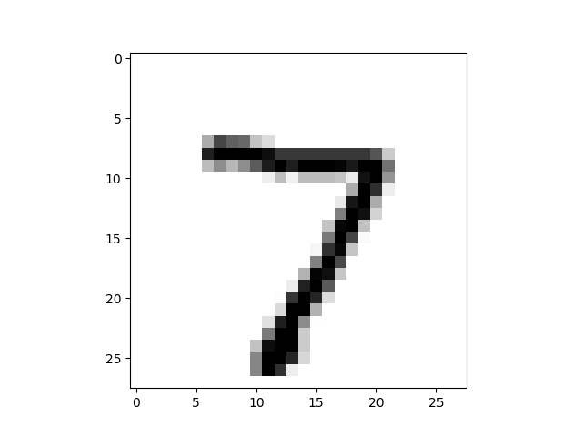
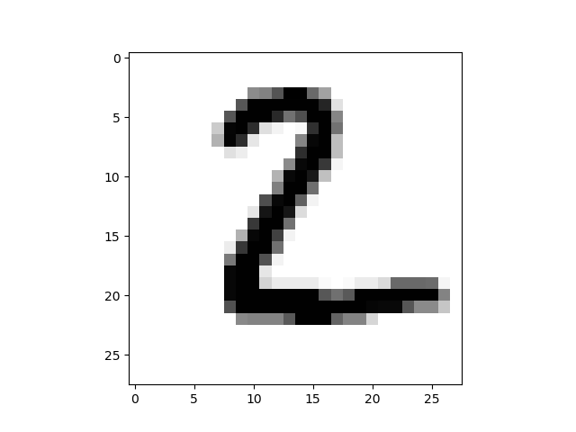
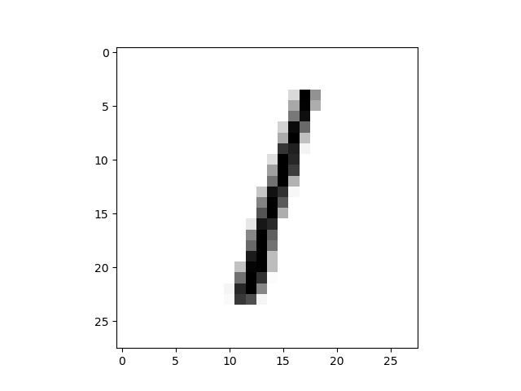 
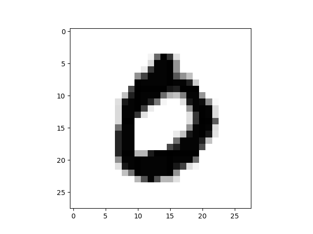
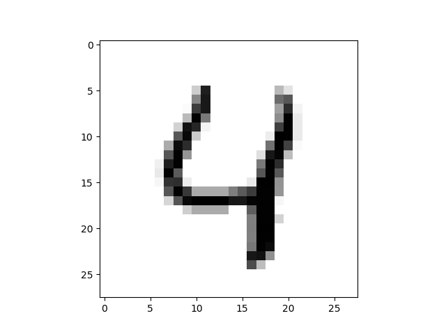
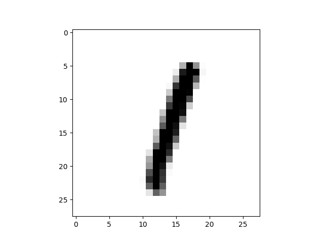
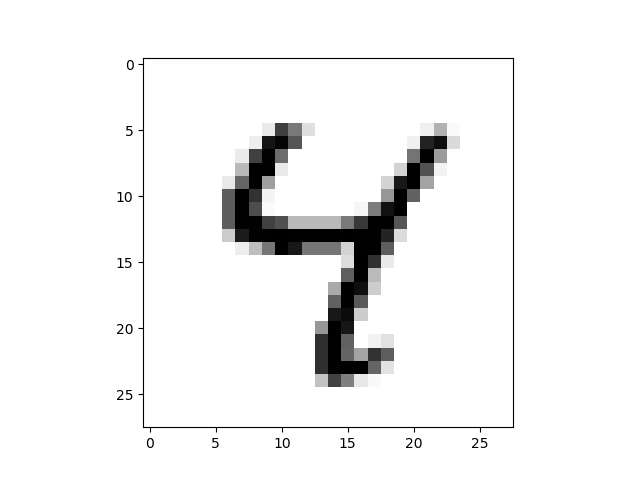
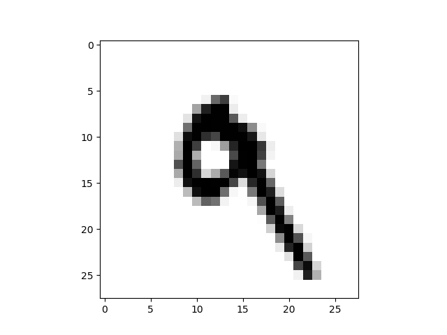
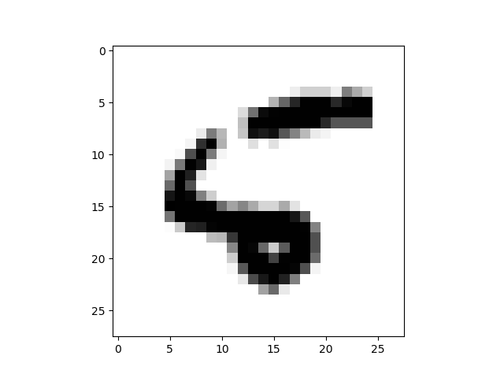
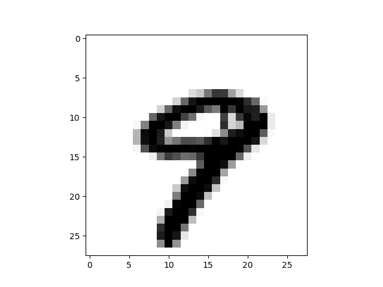
</p>


## Contents of the repository

#### Source files for shared libraries written in `C`
- `libdist.c` defines the `C` function `csolve_poisson` to solve poisson equation.
- `pydist.pyx` is used to interface `csolve_poisson` into python code and defines all distance functions.
- `setup.py` contains the necessary instructions to compile the Cython library.

#### Core files 
- `methods.py` general purpose methods. 
- `classify.py` definition and initialization of the classificator.


#### Testing and visualization
- `plot.py` used to visualize the results.
- `test.py` contains the unittests and benchmarks.

## To do

- More unittest.
- More benchmarks.
- Show which images failed classification.

## Solution to the assignments

### Assignment 1.
See file `methods.py`. 
Here below the performance of
the distance functions implemented, running on an array size of *NxN*
with *N=1000*. The complexity is *O(N^2)*.

```
dist_oo for images of size (1000, 1000): 0.00948 seconds
dist_1 for images of size (1000, 1000): 0.00583 seconds
dist_2 for images of size (1000, 1000): 0.00899 seconds
```

### Assignment 2.
See file `init.py`. 
Here below the performance of the
computation of matrix distances for *N* images of size 
*SxS* with *S=28* and *N=100*. The complexity is *O(N^2 S^2)*.

```
dist_matrix for 100 images of size (28, 28) using dist_oo: 0.15924 seconds
dist_matrix for 100 images of size (28, 28) using dist_1: 0.14767 seconds
dist_matrix for 100 images of size (28, 28) using dist_2: 0.14563 seconds
```

### Assignment 3.

Distance table for the first *N=100* images using the function `dist_oo`.
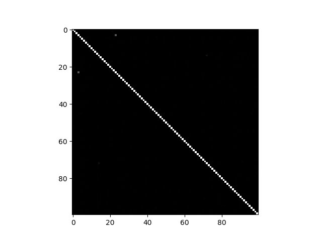

Distance table for the first *N=100* images using the function `dist_1`.
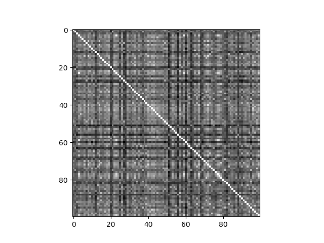

Distance table for the first *N=100* images using the function `dist_2`.
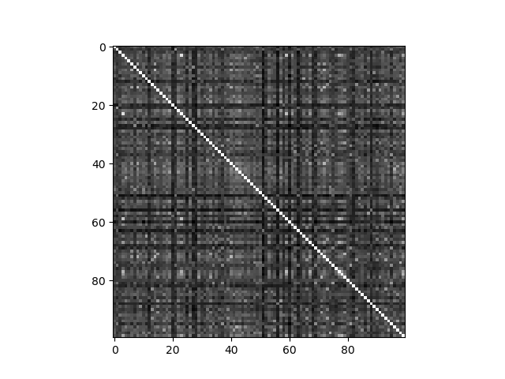

### Assignment 4.
See file `init.py`

### Assignment 5.

Distance table error for five different distance functions.
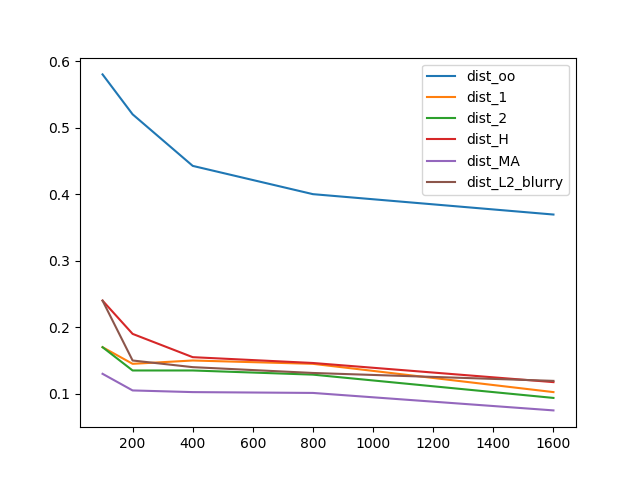

```
[[0.58     0.17     0.17     0.24     0.13    ]
 [0.52     0.145    0.135    0.19     0.105   ]
 [0.4425   0.15     0.135    0.155    0.1025  ]
 [0.4      0.145    0.12875  0.14625  0.10125 ]
 [0.369375 0.1025   0.09375  0.1175   0.075   ]]
```

### Assignment 6.

Here below the performance of
the distance function `dist_H`, running on an array size of *NxN*
with *N=1000*. The complexity is *O(N^2)*.
```
dist_H for images of size (1000, 1000): 0.03278 seconds
```
Here below the performance of the
computation of matrix distances for *N* images of size 
*SxS* with *S=28* and *N=100*. The complexity is *O(N^2 S^2)*.
```
dist_matrix for 100 images of size (28, 28) using dist_H: 0.78396 seconds
```

The errors of the distance table for *N=100,200,400,800,1600* are
`[0.24, 0.19, 0.155, 0.14625, 0.1175]` respectively.

Distance table for the first *N=100* images using the function `dist_H`.
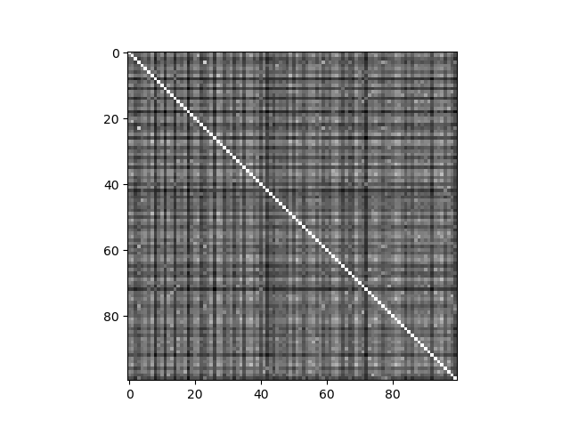

### Assignment 7.

Here below the performance of
the distance function `dist_MA`, running on an array size of *NxN*
with *N=1000*. The complexity is *O(N^2 T)*, where *T* is the number
of steps used to solve the Poisson Equation using Jacobi's method.
We fix *T=100*.
```
dist_MA for images of size (1000, 1000): 0.07709 seconds
```
Here below the performance of the
computation of matrix distances for *N* images of size 
*SxS* with *S=28* and *N=100*. The complexity is *O(N^2 T S^2)*.
```
dist_matrix for 100 images of size (28, 28) using dist_MA: 3.00380 seconds
```

The errors of the distance table for *N=100,200,400,800,1600* are
`[0.14, 0.105, 0.1025, 0.0975, 0.075625]` respectively.

Distance table for the first *N=100* images using the function `dist_MA`.
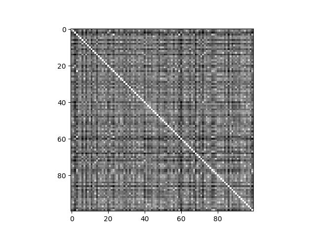


### Assignment 8.

The following are the solutions to the Poisson (phi) applied to the
first 10 images in the test set.

<p float="left">
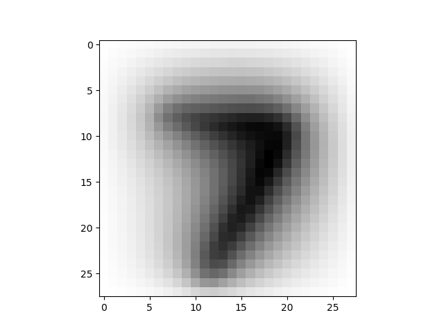
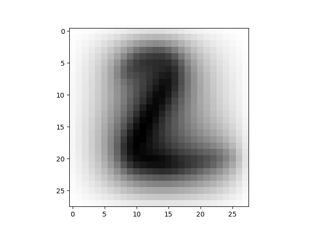
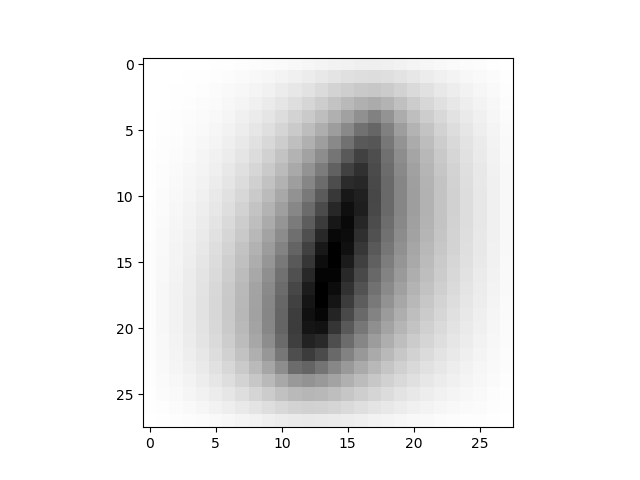 
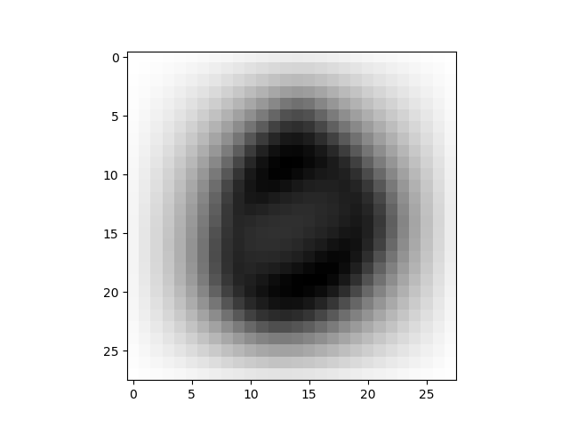
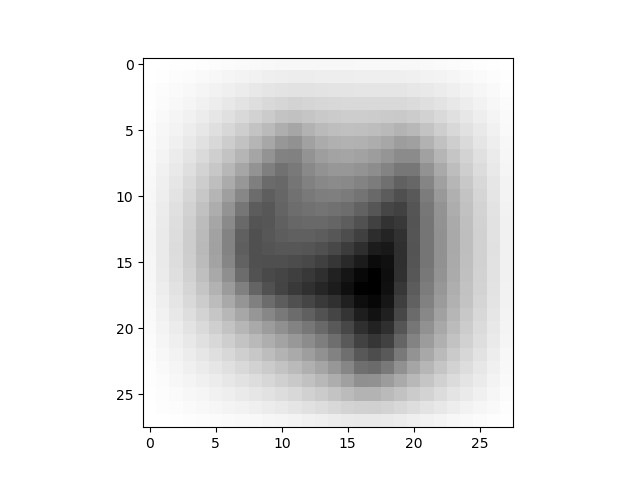

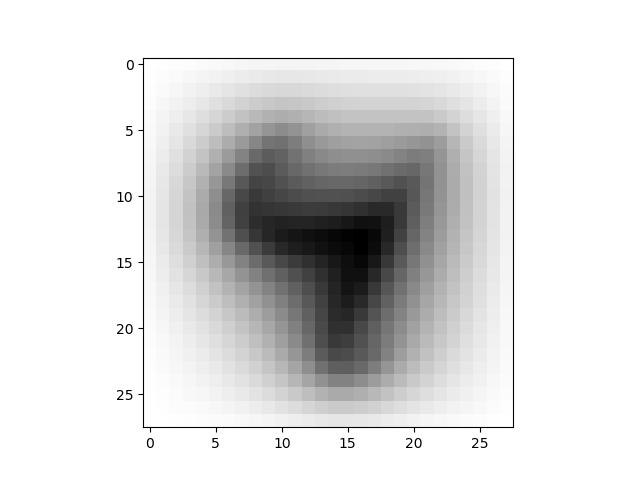
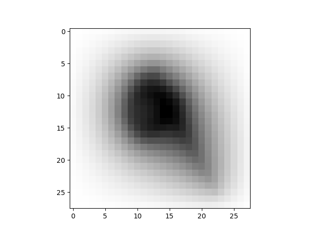
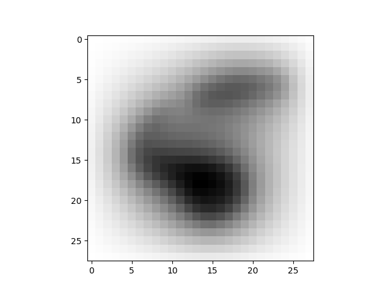
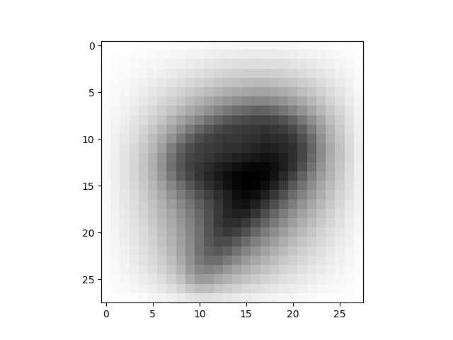
</p>

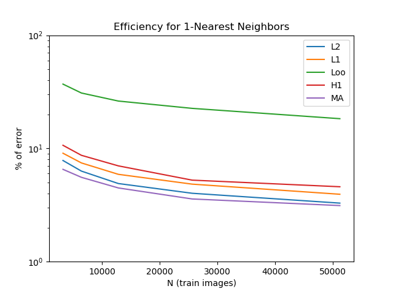
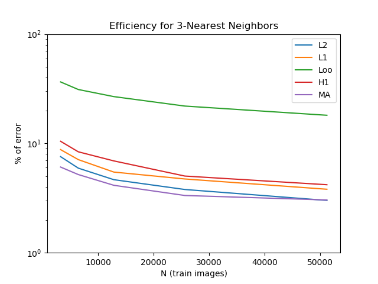
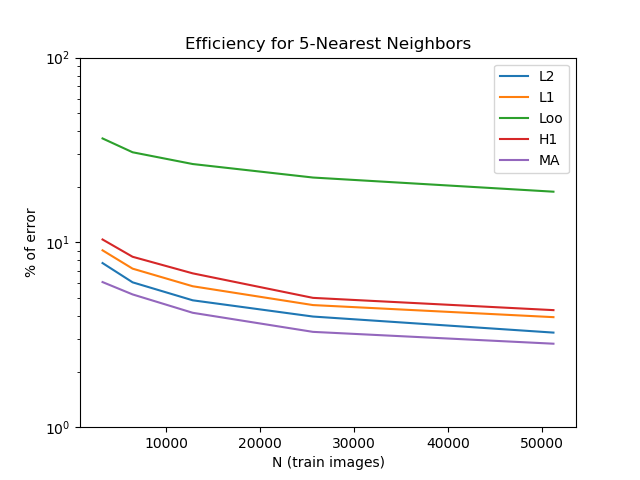
