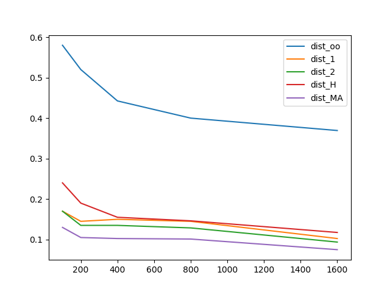

# Numerical analysis project p1.4
Final exam of Numerical Analysis for the Master in High Performance Computing

author: Myself

### Assignment 1.
See file `methods.py`. Here below the performance of
the distance functions implemented, running on an array size of 1000x1000.

```
dist_oo at 1000: 	0.00952 seconds
dist_1 at 1000: 	0.00592 seconds
dist_2 at 1000: 	0.00905 seconds
```

### Assignment 2.
See file `init.py`

### Assignment 3.

Distance table for the first *N=100* images using the function `dist_oo`.


Distance table for the first *N=100* images using the function `dist_1`.


Distance table for the first *N=100* images using the function `dist_2`.


### Assignment 4.
See file `init.py`

### Assignment 5.

Distance table error for three different distance functions.

